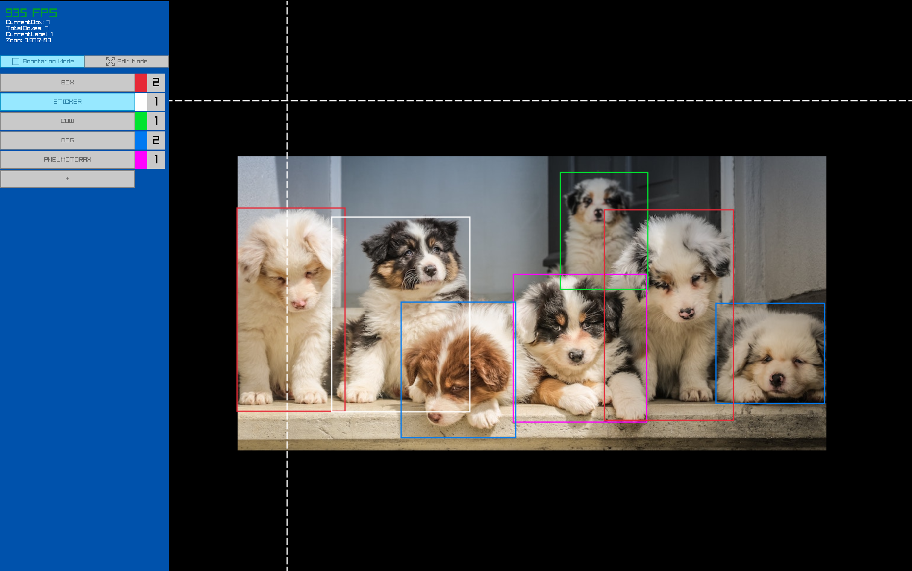

## This is under development

A simple software written for raylib to help people annotate images for image detection neural networks.\\

## TODO

- Save Annotations - and YOLO format
- Add menu:
    - 1) Select project/folder, init new project etc
    - 2) Thumbnails.. visualize stats and project
    - 3) Finalize project -> train/test/val split -> tranformations ? -> output
- Multiple output formats
- Train a YOLO directly from the app

